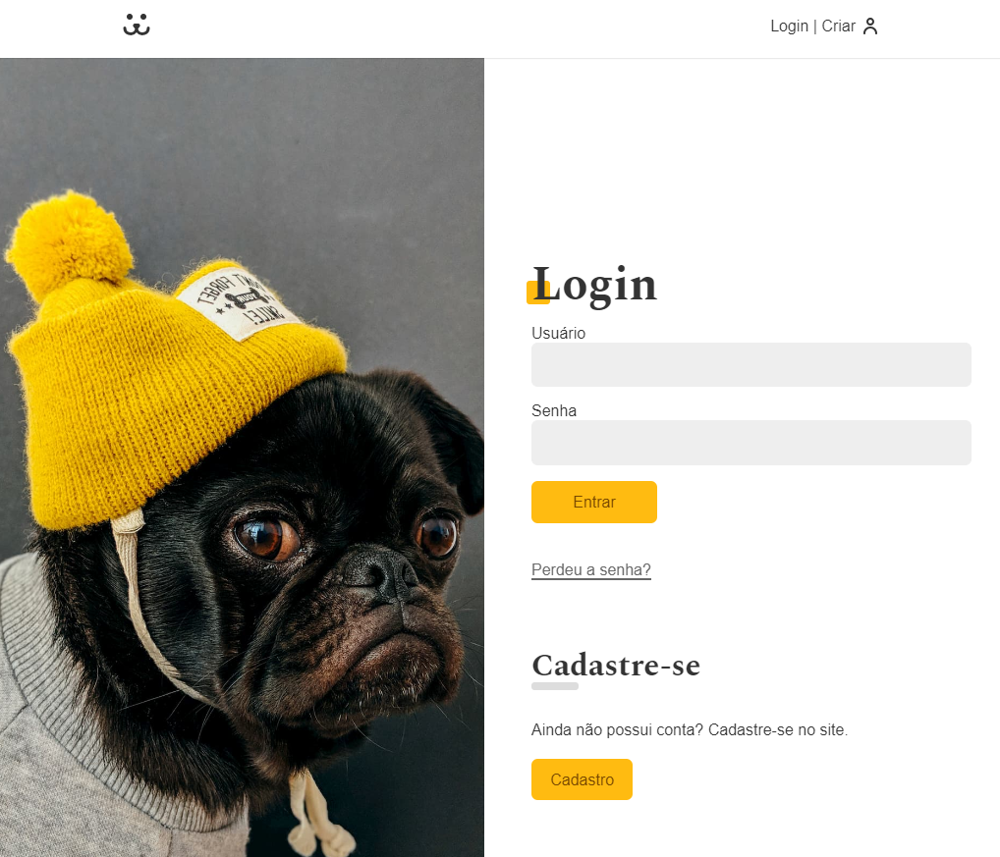
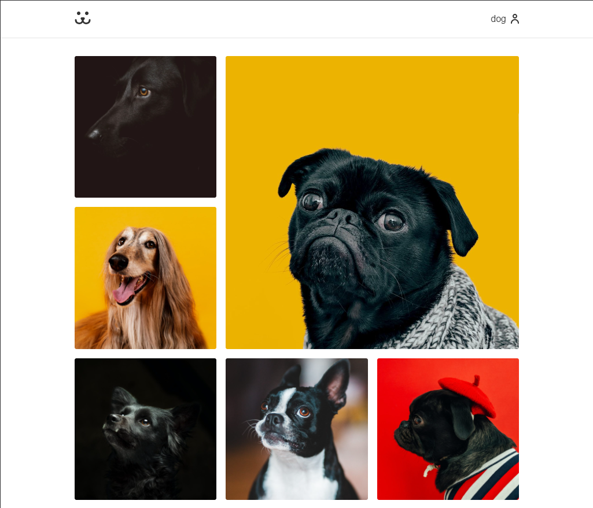
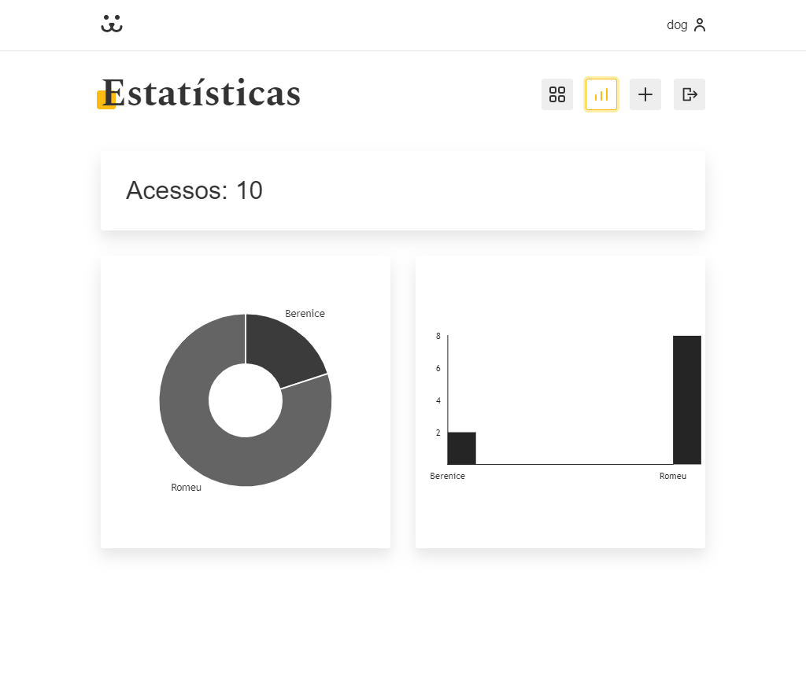

# dogs-react

Dogs é uma rede social de cachorros feita em React. Com Dogs, os usuários podem criar uma conta, fazer login, compartilhar postagens e interagir por meio de comentários. Além disso, o projeto oferece recursos como scroll infinito e estatísticas sobre as fotos compartilhadas pelos usuários.

  <h3>Tela de Login</h3>
  

  <h3>Feed</h3>
  

  <h3>Estatísticas</h3>
  

